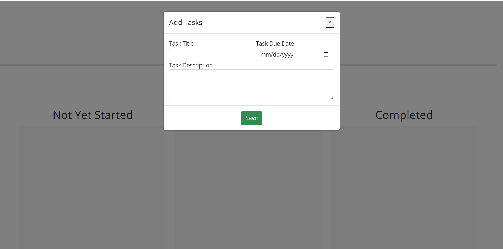
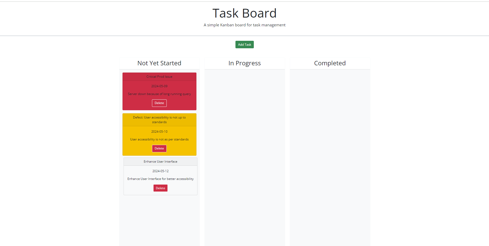
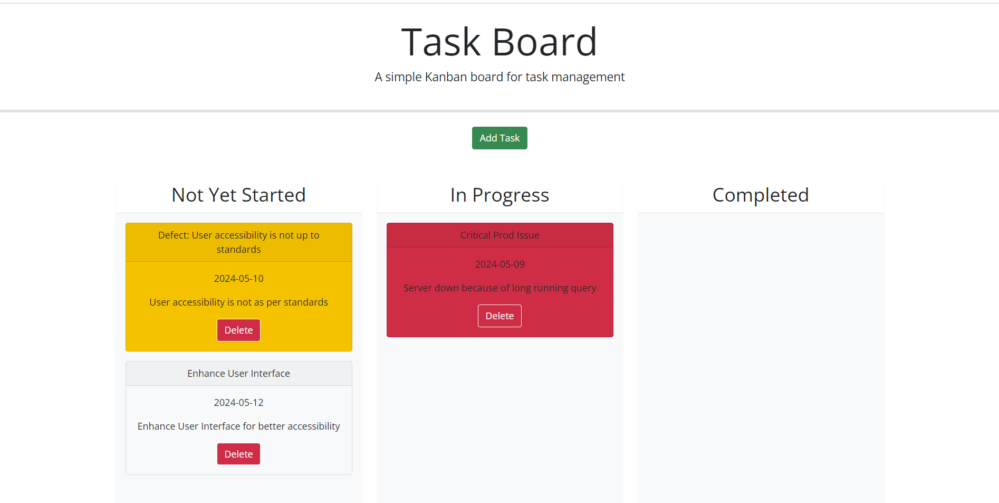
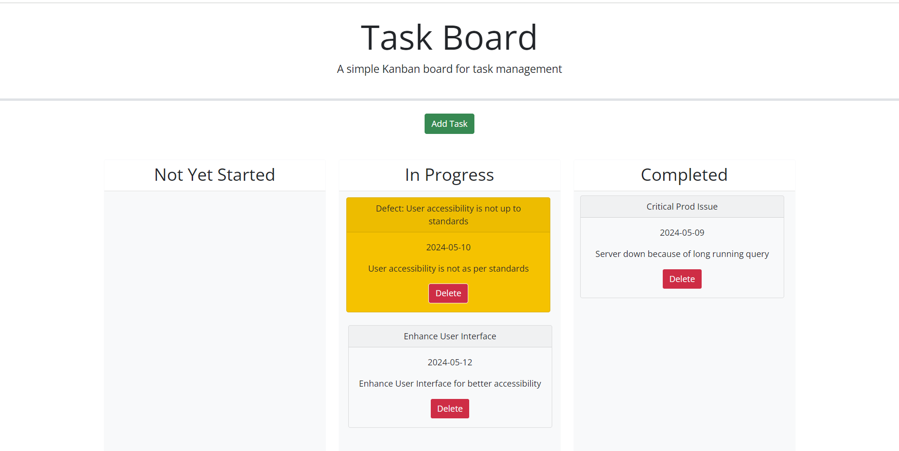

# Tasks Management Board

## Description

Tasks Management Board is a kanban board, used to manage tasks. The tasks can be added on the fly and easily managed to track the task status by dragging and dropping them on to respective swimlanes. The app leverages the features of Bootstrap framework to deliver rich user interface and jQuery library for DOM tree traversal and manipulation, as well as event handling. Tasks are saved to local storage and updates made to tasks are saved as well.

## Screenshots

## Link to Deployed Site

https://pranithgunda.github.io/tasks-management-board/
